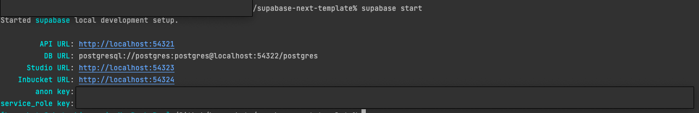

# Supabase Next Template for Me

基本作成者は日本人なので日本語多様です。英語にするつもりは今のところないです。

## アーキテクチャ
- Supabase
- Prisma
- Next (Deploy to Vercel)

(Supabaseをベースにしたくはないけど、Postgresに対してクライアントからnode-moduleで呼び出せたりするのはめっちゃ便利なので依存するけど、全てNextのAPIからデータ取得できるようにすれば、Prismaが全てを解決してくれるので、もはや不要になる。)

## 必要環境
- Docker
  - 筆者はDocker Desktopを使ってるが、企業勢の人はよしなに・・・。
- Supabaseのローカル環境
  - https://www.supabase.jp/docs/guides/local-development
- node: v16.5.0
  - 筆者はtj/nを導入しているので`n auto`でnodeのバージョンを変更できるようにしてますが、nvmの人はよしなに・・・。

## 使い方
- 基本は、`.env.template`に記載の物を`.env`へコピーして、実行すればいけるはず。
- `supabase start`でSupabaseのローカル環境が立ち上がるので、そこにPostgresやらなんやらがだいたい入っているのでそれを信じる。

- PostgresのURLなどはstart時の値を入れれば良い。
